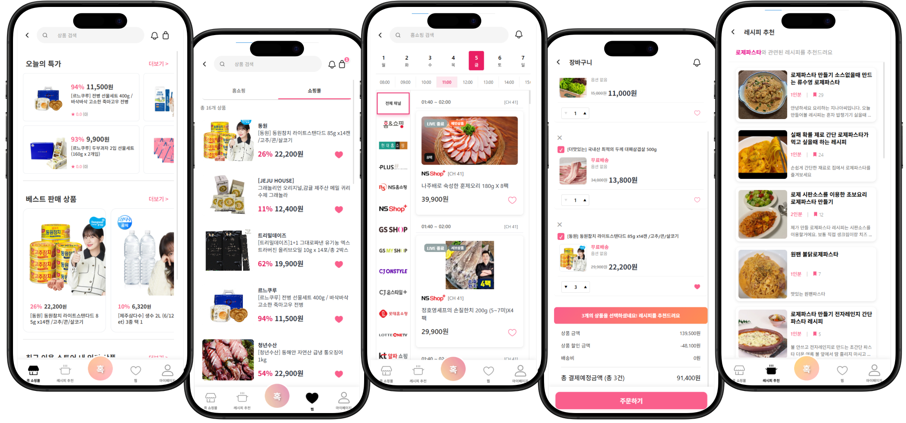
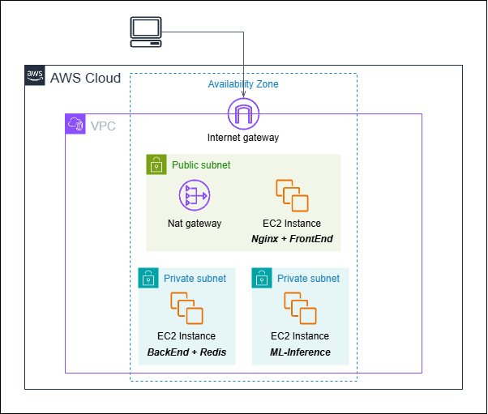

# Eat’s 유혹(Uhok)

## 개요

**Eat's Uhok**은 U+ 콕 & 홈쇼핑을 기반하여 상호 연동하고 사용자 맞춤 식재료 및 레시피를 추천하는 서비스입니다.

### 프로젝트 기간
2025.07.23 ~ 09.12 (발표 09.13)

### 팀원 소개

## 기술 스택

#### 프론트엔드
  

#### 백엔드
    

#### 데이터 수집
  

#### 데이터베이스
   

#### 분석 알고리즘
  

#### 배포
  

## 기능

### 홈쇼핑–쇼핑몰 연계 추천
- `홈쇼핑(U+TV) ↔ U+콕 쇼핑` 간 유사/대체 상품 자동 매칭
- 찜/장바구니 기반으로 방송 알림 제공

### 레시피 기반 개인화 추천
- 키워드/보유 재료/시청·구매 이력 기반 **맞춤형 레시피 추천**
- 레시피에서 필요한 식재료 ↔ 즉시 구매 연결 

### 통합 검색 기능
- `홈쇼핑 방송 상품` + `U+콕 쇼핑몰 상품`을 동시에 탐색  
- 시간대/카테고리/재료 필터링 가능  

#### 원스텝 쇼핑 경험
- `방송 시청 → 레시피 확인 → 식재료 선택 → 즉시 구매`까지 한 흐름으로 연결  

### 주문 및 결제
- 결제 서버를 통한 주문 처리
- 자동 결제 완료/실패
- 자동 주문 상태 변경(결제완료→배송중→배송완료)
- 주문 상태 변경 알림

### 방송 알림 ~~& 푸시 알림~~
- 방송 편성 시 알림 ~~제공~~
- 홈쇼핑 방송 알림, 배송 상태 알림 등의 알림 데이터는 DB에 적재하지만, 푸시 알림은 백엔드에서 미구현

## ERD

## 시스템 아키텍쳐

## 클라우드 아키텍처

## 수상 사진

> **LG유플러스상 (1위)** | LGU+WhyNotSWCamp 경진대회 (2025.09.13)

## 아쉬웠던 점

- **로그 처리**

- **DB 배포**  

- **자동화 시스템 부족**

- **보안**
